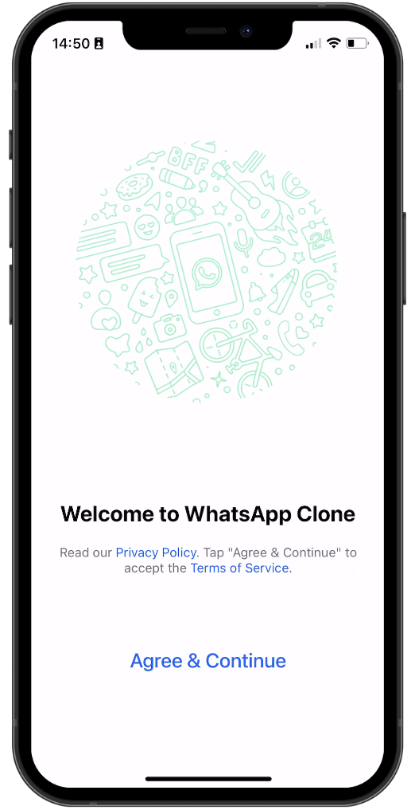
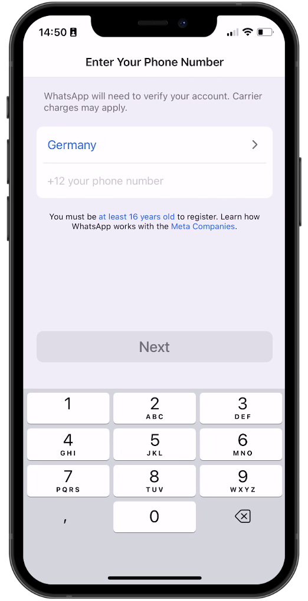
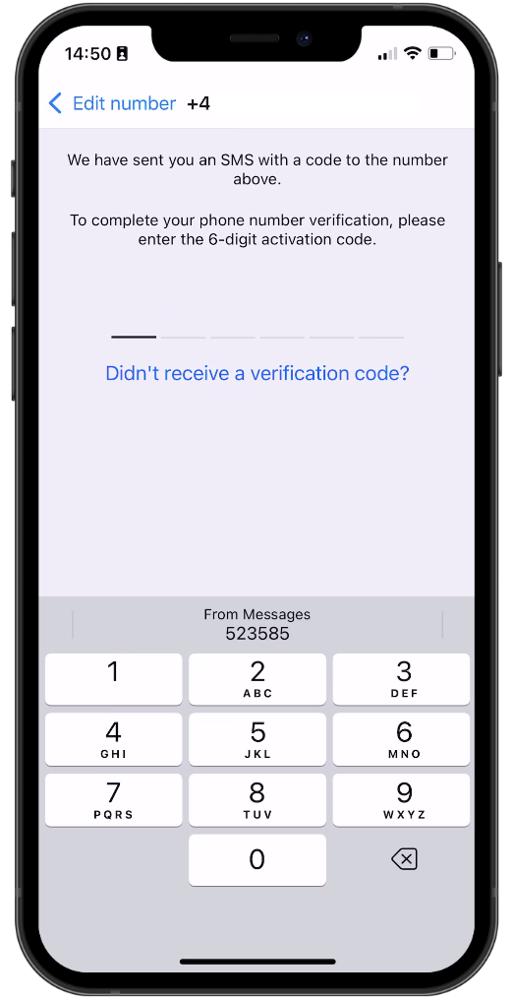
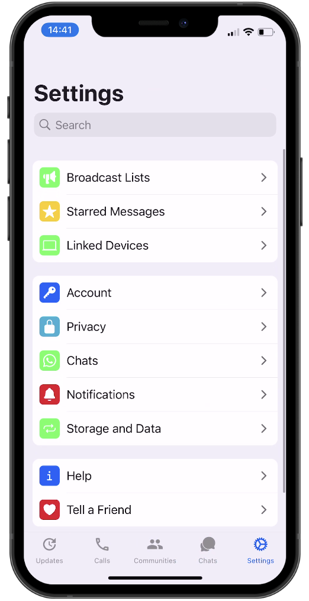
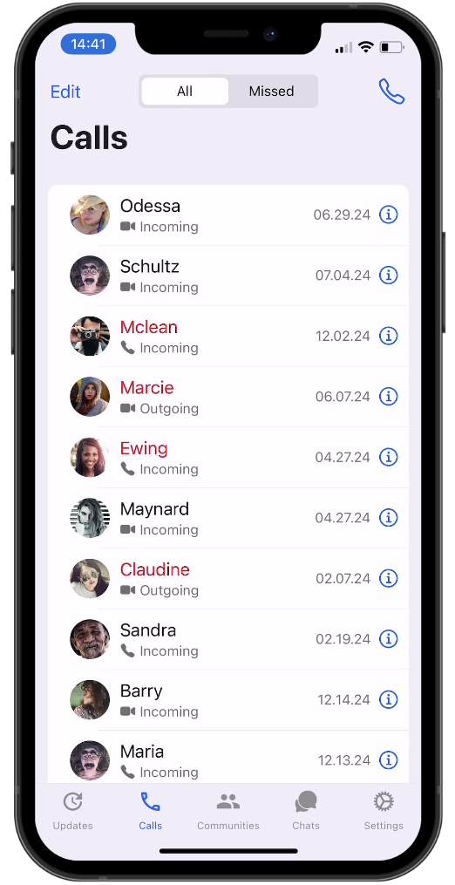
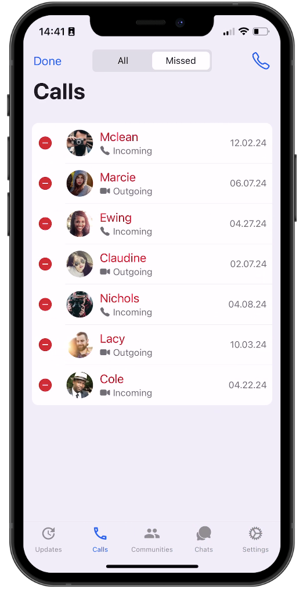
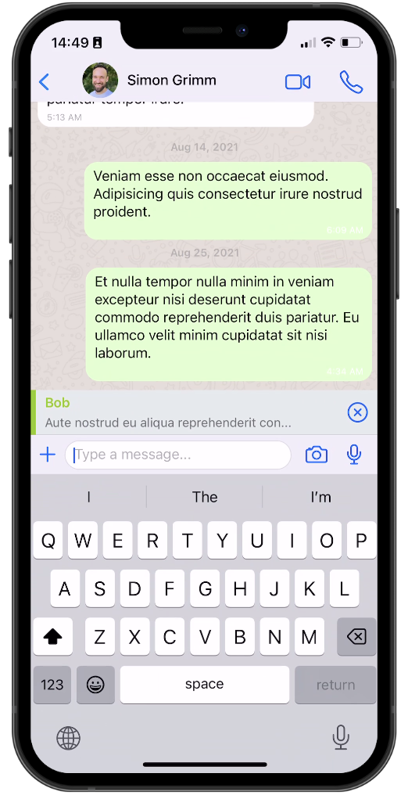
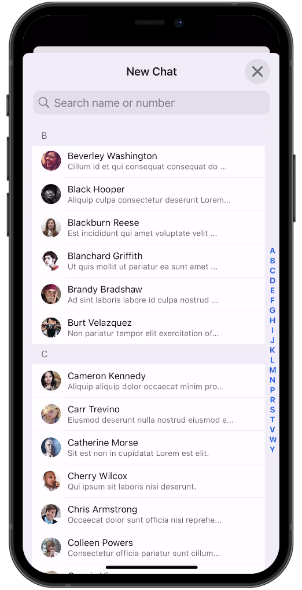
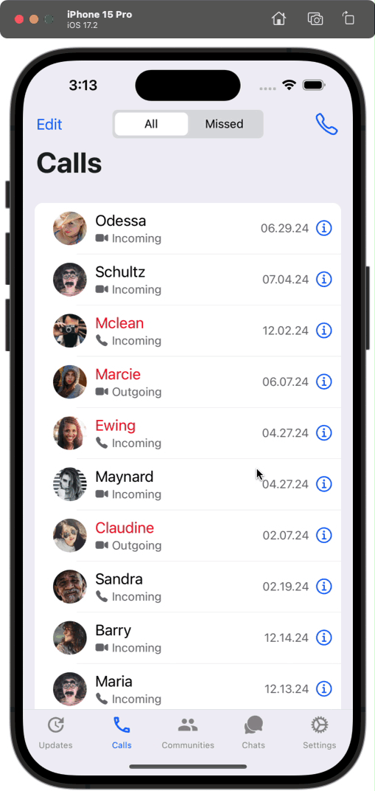
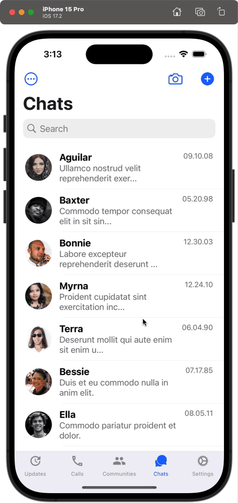

# React Native WhatsApp Clone with Clerk

This is a React Native WhatsApp clone using [Clerk](https://clerk.com/?utm_source=sponsorship&utm_medium=github&utm_campaign=simong&utm_content=rn-whatsapp) for user authentication with OTP.

Additional features:

- [Expo Router](https://docs.expo.dev/routing/introduction/) file-based navigation
- [SMS OTP](https://clerk.com/docs/custom-flows/email-sms-otp?utm_source=sponsorship&utm_medium=github&utm_campaign=simong&utm_content=rn-whatsapp) Auth with Clerk
- [Reanimated](https://docs.swmansion.com/react-native-reanimated/) 3 for animations
- [Gesture Handler](https://docs.swmansion.com/react-native-gesture-handler/) for gestures
- [Gifted Chat](https://github.com/FaridSafi/react-native-gifted-chat) for chat UI

## Screenshots

## Demo

## 🚀 More

**Take a shortcut from web developer to mobile development fluency with guided learning**

Enjoyed this project? Learn to use React Native to build production-ready, native mobile apps for both iOS and Android based on your existing web development skills.

